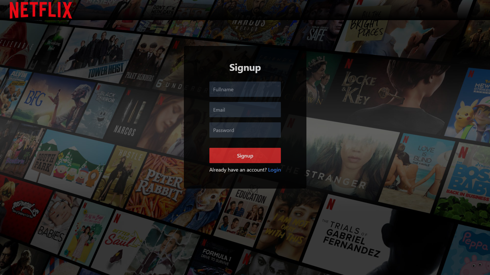
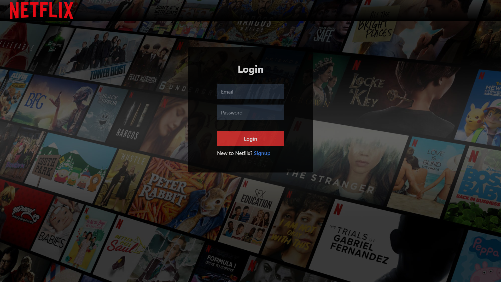
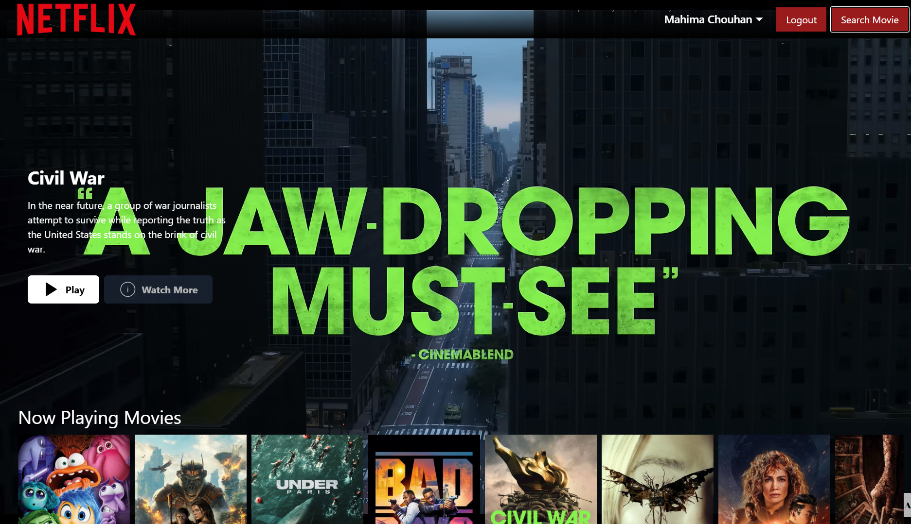
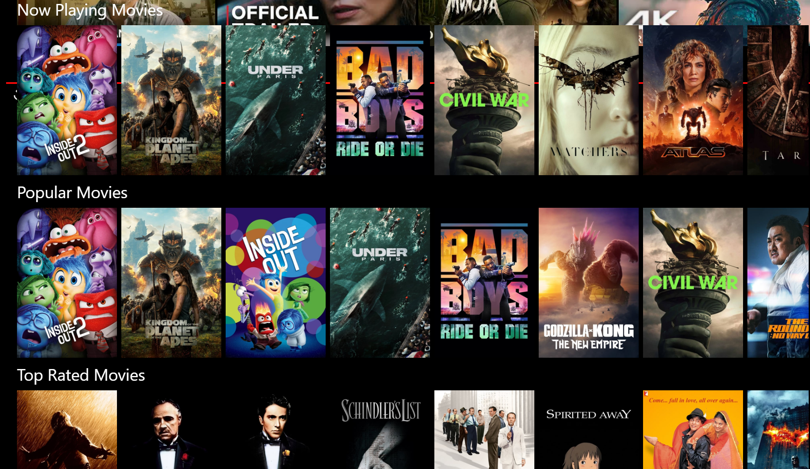
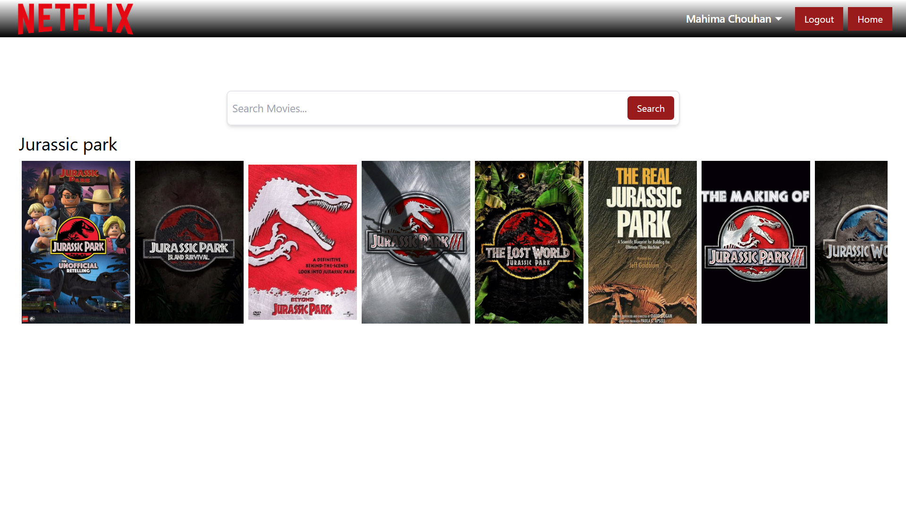

# Netflix Clone

A React-based Netflix clone application with a rich feature set including authentication, movie browsing, and detailed movie information using various APIs.

## Images

1.Registration page (Sign-up)



2. Login page



3. Home Page (Browse page)



4. Movies



5. Search




## Table of Contents

- [Netflix Clone](#netflix-clone)
  - [Images](#images)
  - [Table of Contents](#table-of-contents)
  - [Technologies Used](#technologies-used)
  - [Features](#features)
  - [Prerequisites](#prerequisites)
  - [Project Structure](#project-structure)
  - [Installation](#installation)
  - [Running the Project](#running-the-project)
  - [Available Scripts](#available-scripts)
  - [APIs and Utils](#apis-and-utils)
  - [Redux Store](#redux-store)
  - [Custom Hooks](#custom-hooks)
  - [License](#license)


## Technologies Used

- React
- Redux (for state management)
- Tailwind CSS (for styling)
- React Router (for routing)
- Axios (for API requests)
- React Hot Toast (for notifications)
- Material UI (for UI components)
- TMDB API (for movie data)

## Features

- User Authentication (Login and Signup)
- Browse movies by categories (Now Playing, Popular, Top Rated, Upcoming)
- Search for movies
- View movie details and trailers
- Responsive design
- 
## Prerequisites

- Node.js (version >= 14.x)
- npm (version >= 6.x) or yarn (version >= 1.x)

## Project Structure

```plaintext
.
├── public
│   ├── images
│   │   └── ...
│   ├── index.html
│   └── ...
├── src
│   ├── components
│   │   ├── Body.js
│   │   ├── Header.js
│   │   ├── Login.js
│   │   ├── Browse.js
│   │   ├── MainContainer.js
│   │   ├── MovieCard.js
│   │   ├── MovieContainer.js
│   │   ├── MovieDialog.js
│   │   ├── MovieList.js
│   │   ├── SearchMovie.js
│   │   ├── VideoBackground.js
│   │   ├── VideoTitle.js
│   │   └── ...
│   ├── hooks
│   │   ├── useMovieById.js
│   │   ├── useNowPlayingMovies.js
│   │   ├── usePopularMovies.js
│   │   ├── useTopRatedMovies.js
│   │   ├── useUpcomingMovies.js
│   │   └── ...
│   ├── redux
│   │   ├── store.js
│   │   ├── movieSlice.js
│   │   ├── searchSlice.js
│   │   └── userSlice.js
│   ├── utils
│   │   └── Constant.js
│   ├── App.js
│   ├── index.js
│   └── index.css
├── .gitignore
├── README.md
├── package.json
└── tailwind.config.js
```
## Installation

1. Clone the repository:
   ```sh
   git clone https://github.com/chouhanmahima/Netflix-Frontend.git
   cd netflix-clone
   ```

2. Install dependencies:
```sh
    npm install
```
## Running the Project

1. Start the development server:
```sh
    npm start
```
1. Open http://localhost:3000 to view it in the browser.


## Available Scripts

In the project directory, you can run:

* `npm start`: Runs the app in the development mode.

* `npm run build:` Builds the app for production to the build folder.

* `npm test`: Launches the test runner in the interactive watch mode.

## APIs and Utils

`Constant.js`

Contains important constants such as API endpoints and options for making requests to the TMDB API.

```javascript
export const API_END_POINT = "https://api.example.com";
export const SEARCH_MOVIE_URL = "https://api.themoviedb.org/3/search/movie?query=";
export const TMDB_IMG_URL = "https://image.tmdb.org/t/p/w500";
export const options = {
  headers: {
    "Authorization": "Bearer YOUR_TMDB_API_KEY"
  }
};
```

## Redux Store

1. `store.js`

Configures the Redux store and integrates Redux slices.

2. `movieSlice.js`

Handles state and actions related to movies (now playing, popular, top rated, upcoming, and trailer movie).

3. `searchSlice.js`

Manages the state for searched movies.

4. `userSlice.js`

Manages user authentication state and loading state.

## Custom Hooks

1. `useNowPlayingMovies.js`

Fetches and dispatches the now playing movies data.

2. `usePopularMovies.js`

Fetches and dispatches the popular movies data.

3. `useTopRatedMovies.js`

Fetches and dispatches the top rated movies data.

4. `useUpcomingMovies.js`

Fetches and dispatches the upcoming movies data.

5. `useMovieById.js`

Fetches and dispatches the trailer movie data based on movie ID.

## License

This project is licensed under the MIT License. See the LICENSE file for details.